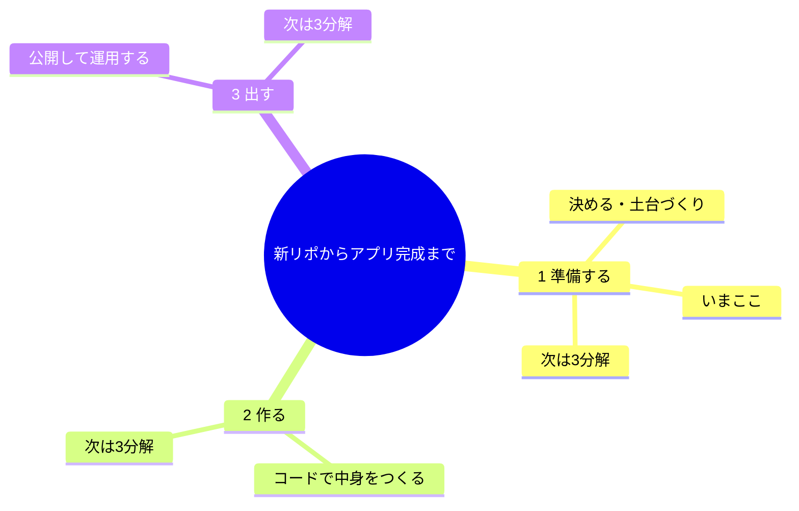

# 学習ロードマップ（アプリ制作の全体地図）

新リポ作成を **スタート**、ユーザーが実際に使えるアプリが動いている状態を **ゴール** とした、
アプリ制作の全体像。行き当たりばったりを卒業し、体系的に理解していくための「生きた地図」。

## この地図の使い方（育て方の規約）

- **一度に細かくしない。** まず全体を 3 分割し、知りたい枝だけ深掘りする。
- **3 分解 × 3 分解で育てる。** 掘りたいときは「**◯番を3つに割って**」と依頼する。
  依頼された枝だけを 3 つに分解して、このファイルに追記していく。
- どの AI ツール（Claude Code / Codex / Cursor / Antigravity）でも、このファイルを地図として参照・更新する。

## 全体地図（まず3分割）

## 3つのフェーズ（ひとことで）

| # | フェーズ | ひとことで | 中身をざっくり |
|---|---|---|---|
| **1** | 準備する | 何で作るか決めて、土台を用意する | 新リポ作成・スタック選定・フォルダ/設定の土台 |
| **2** | 作る | コードを書いて、動く状態にする | 画面・処理・データ、そして品質チェック |
| **3** | 出す | 公開して、使える・保てる状態にする | デプロイ・運用・直し続ける仕組み |

## 現在地（2026-07-20）

- **フェーズ1「準備する」の終盤**にいる。
  - ✅ 済: 新リポ作成 / スタックの決め方（初期化フロー）/ pnpm モノレポ土台 / AGENTS.md 整備
  - ⬜ 未: フェーズ2「作る」以降（アプリの中身はこれから）

## 育てログ

3 分解を依頼するたびに、その内容をここに追記して地図を育てていく。

- （まだ無し。最初の深掘りは「1. 準備する」を3分解するのが自然）
